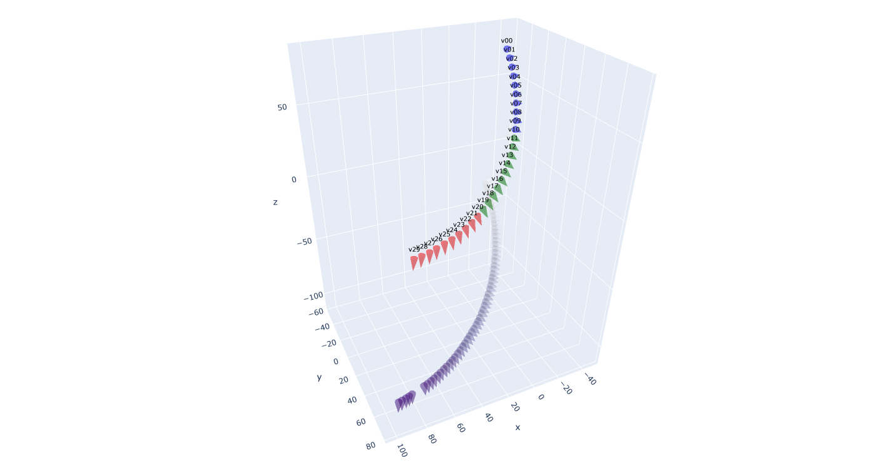

## Camera Pose Visualization Tool
This project contains a Python script that visualizes 3D poses and camera trajectories from provided CSV and JSON files. The visualization is implemented using Plotly, which generates an interactive 3D plot.

The CSV file should contain pose data, and the JSON file should contain camera data including position and rotation. Additionally, the tool allows customization of the visualization through a configuration JSON file. Users can specify main camera identifiers, cone size, text size, and the range of graph axes in the configuration file.

This tool could be useful for individuals working with 3D pose estimation tasks, computer vision, or robotics, where visualizing poses and camera movements is crucial.



**Note:** This project assumes you have the following Python libraries installed: pandas, numpy, matplotlib and plotly

## GitHub README Update

Date: 12th September 2023

<b>[Camera Parameters]</b>: You can now assign groups to different cameras and display them in distinct colors. This feature works similarly to the main camera setting from the previous version.

<b>[Pose Data]</b>: Instead of lines, pose data is now visualized in the shape of cones (to represent the viewport angles of the pose data). Typically, pose data is set at a very fine granularity, so we've introduced a feature to visualize them at specific intervals. You can adjust this interval in the code.

<b>[Config File]</b>: We've removed the need for a config file. Depending on the sequence size, you might need to adjust the size in the code where the cone shape is set for visualization. To implement more diverse features, we recommend checking out the usage of the Plotly library.

<b>[Added Two Pose Data Creation Codes]</b>: We've added two pieces of code to the project that can help you create custom pose data based on existing json camera parameter files and csv pose data files.

<b> 1. [Interpolated Pose Trace Creation]</b> - `<camera_pose_interpolation.py>` : If you have discrete camera parameters, this code helps in generating a more continuous pose. It's written based on the json file, and when you list the camera views in camera_sequence, it will interpolate values in order and create a csv.

<b> 2. [CSV File Transformation]</b> - `<transform_pose.py>` : This code is designed to transform csv camera pose data. It operates via command with six arguments: input csv file path, first reference point, first range, second reference point, second range, and output file path. It adds movement that rotates around both reference points within their respective ranges and adjusts the overall pose data length by trimming the start and end, thereby preserving the total length of pose data.


## Usage
To run the tool, use the command:
```bash
python camera_visualize.py <csv_file> <json_file> 
```
Replace `<csv_file>` and `<json_file>` with your actual file paths.

Please refer to the sample files in the repository to understand the expected format of the input files.


